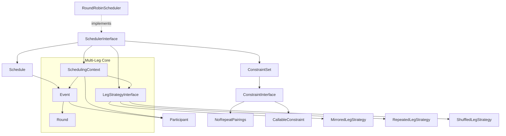

# System Patterns: Tactician

## System Architecture

The Tactician library follows a layered architecture with clear separation of concerns:

### **1. Data Layer (DTOs)**
```
src/DTO/
├── Participant.php      # Immutable participant representation
├── Event.php           # Immutable match/event representation  
├── Round.php           # Immutable round representation with metadata
├── Schedule.php        # Iterator/Countable collection of events
└── [Future] TimeSlot.php, ScheduledEvent.php
```

### **2. Scheduling Layer** 
```
src/Scheduling/
├── SchedulerInterface.php       # Contract for all schedulers (inherently multi-leg aware)
├── SchedulingContext.php        # Multi-leg historical state management
├── RoundRobinScheduler.php      # Circle method with integrated multi-leg generation
└── [Future] SwissScheduler.php, PoolScheduler.php
```

### **3. Leg Strategy Layer**
```
src/LegStrategies/
├── LegStrategyInterface.php     # Strategy contract for leg generation
├── MirroredLegStrategy.php      # Home/away role reversal strategy
├── RepeatedLegStrategy.php      # Identical leg repetition strategy
├── ShuffledLegStrategy.php      # Randomized pairing order strategy
└── [Future] AdvancedLegStrategies/
```

### **4. Constraint Layer**
```
src/Constraints/
├── ConstraintInterface.php             # Constraint contract
├── ConstraintSet.php                  # Builder pattern container
├── NoRepeatPairings.php               # Built-in no-repeat constraint
├── MinimumRestPeriodsConstraint.php   # Time-based rest period enforcement
├── SeedProtectionConstraint.php       # Tournament seeding protection
├── ConsecutiveRoleConstraint.php      # Positional/role-based constraints
├── MetadataConstraint.php             # Flexible metadata-based rules
└── [Future] TimeConstraints/, VenueConstraints/
```

### **5. Exception Layer**
```
src/Exceptions/
└── SchedulingException.php     # Domain-specific exceptions
```

## Key Technical Decisions

### **Immutability First**
- All DTOs are `readonly` classes preventing mutation after construction
- Methods return new instances rather than modifying existing ones (e.g., `Schedule::addEvent()`)
- Ensures thread safety and predictable behavior

### **Modern PHP 8.2+ Features**
- `readonly` classes for immutable value objects
- Constructor property promotion for cleaner code
- Strict typing throughout (`declare(strict_types=1)`)
- Union types and nullable types where appropriate

### **Interface Segregation**  
- `SchedulerInterface` defines contract for all scheduling algorithms
- `ConstraintInterface` enables pluggable validation rules
- Allows for easy testing and extensibility

### **No Static Dependencies**
- All dependencies injected through constructors
- Enables proper unit testing with mocks
- Supports different configurations per instance

### **Multi-Leg First Principle**
- All schedulers assume multi-leg tournaments by default (legs=1 is special case)
- Leg strategies are core components with integrated generation approach
- SchedulingContext inherently multi-leg aware with full tournament context
- All-or-nothing schedule generation prevents silent event skipping
- Enhanced diagnostic reporting for constraint conflicts and generation failures

## Design Patterns in Use

### **Strategy Pattern**
- `SchedulerInterface` with multiple implementations (`RoundRobinScheduler`, future Swiss/Pool)
- Allows runtime algorithm selection
- Easy to add new tournament formats

### **Builder Pattern**
- `ConstraintSet::create()` provides fluent constraint configuration
- `ConstraintSetBuilder` with method chaining
- Clean API for complex constraint combinations

### **Iterator Pattern**
- `Schedule` implements `Iterator` and `Countable`
- Memory-efficient traversal of events
- Standard PHP iteration interface

### **Template Method Pattern**
- Common scheduling logic can be extracted to abstract base class
- Algorithm-specific steps overridden in concrete implementations
- Future: `AbstractScheduler` base class

### **Factory Pattern**
- `MetadataConstraint` with factory methods for common patterns
- `ConsecutiveRoleConstraint` with specialized factories (homeAway, position)
- Simplified constraint creation for standard use cases

### **Command Pattern (Future)**
- Constraint violations as command objects
- Detailed reporting and resolution strategies
- Undo/redo capabilities for schedule modifications

## Component Relationships



## Critical Implementation Paths

### **Integrated Multi-Leg Round-Robin Scheduling Flow**
1. **Input Validation**: Minimum 2 participants, valid leg count, and strategy required
2. **Multi-Leg Context Setup**: Initialize SchedulingContext with full tournament parameters
3. **Unified Generation Loop**: For each leg, for each round, generate events with strategy
4. **Real-Time Constraint Validation**: Each event validated against complete multi-leg context
5. **All-or-Nothing Result**: Complete schedule or immediate failure with detailed diagnostics
6. **Bye Handling**: Null participants handled consistently across all legs
7. **Circle Method Integration**: Traditional algorithm enhanced with leg strategy application

### **Integrated Multi-Leg Scheduling Flow**
1. **Multi-Leg Context Initialization**: Create SchedulingContext with full tournament parameters (legs, strategy)
2. **Unified Generation Loop**: Generate events for all legs with full cross-leg constraint visibility
3. **Incremental Validation**: Each event validated against complete multi-leg context
4. **All-or-Nothing Result**: Complete schedule generation or clear failure with diagnostics
5. **No Silent Skipping**: Constraint failures cause immediate exception with detailed reporting

### **Enhanced Constraint Validation Flow**
1. **Full Context Creation**: Build SchedulingContext with complete multi-leg tournament state
2. **Cross-Leg Awareness**: Constraints see events from all legs during validation
3. **Early Failure Detection**: Impossible constraints detected as soon as conflicts arise
4. **Detailed Diagnostics**: Constraint violations include suggestions and conflict analysis
5. **Continuous Context Updates**: Context maintained across all legs for accurate validation

### **Schedule Iteration**
1. **Iterator Interface**: Standard PHP iteration protocol
2. **Lazy Evaluation**: Events stored in array but iterated efficiently  
3. **Round Filtering**: Filter events by specific round numbers
4. **Metadata Access**: Schedule-level metadata for algorithm info

## File Structure

```
tactician/
├── .clinerules
├── .gitignore
├── .php-cs-fixer.dist.php
├── composer.json
├── composer.lock
├── LICENSE
├── phpstan.neon
├── phpunit.xml
├── README.md
├── rector.php
├── memory-bank/
│   ├── projectbrief.md
│   ├── productContext.md
│   ├── activeContext.md
│   ├── systemPatterns.md
│   ├── techContext.md
│   ├── progress.md
│   └── refactoringPlan.md        # NEW: Detailed technical specification
├── src/
│   ├── DTO/
│   │   ├── Participant.php      # Advanced DTO with ID/label/seed/metadata
│   │   ├── Event.php           # Multi-participant event with round tracking
│   │   ├── Round.php           # Immutable round representation with metadata
│   │   └── Schedule.php        # Iterator/Countable schedule collection
│   ├── Scheduling/
│   │   ├── SchedulerInterface.php     # Contract for all schedulers
│   │   ├── SchedulingContext.php      # Historical state management
│   │   └── RoundRobinScheduler.php    # Circle method with constraints
│   ├── Constraints/
│   │   ├── ConstraintInterface.php    # Constraint contract
│   │   ├── ConstraintSet.php         # Builder pattern with CallableConstraint
│   │   └── NoRepeatPairings.php      # Built-in constraint implementation
│   └── Exceptions/
│       └── SchedulingException.php   # Domain-specific exceptions
└── tests/
    ├── Pest.php                      # Pest configuration
    ├── TestCase.php                  # Base test case
    ├── Unit/
    │   ├── DTO/
    │   │   ├── EventTest.php
    │   │   ├── ParticipantTest.php
    │   │   ├── RoundTest.php
    │   │   └── ScheduleTest.php
    │   ├── Constraints/
    │   │   └── ConstraintSetTest.php
    │   ├── Exceptions/
    │   └── Scheduling/
    │       └── RoundRobinSchedulerTest.php
    └── Feature/
        └── RoundRobinIntegrationTest.php
```

## Future Architecture Extensions

### **Timeline System**
```
src/Timeline/
├── TimeAssignerInterface.php
├── PatternTimeline.php
├── TimeSlot.php
└── ScheduledEvent.php
```

### **Advanced Constraints**
```
src/Constraints/
├── TimeConstraints/
├── VenueConstraints/
├── ParticipantConstraints/
└── ConstraintViolation.php
```

### **Optimization Layer**
```
src/Optimization/
├── ScheduleOptimizer.php
├── ConflictResolver.php
└── QualityMetrics.php
```

---
*Last Updated: 2025-10-01*
