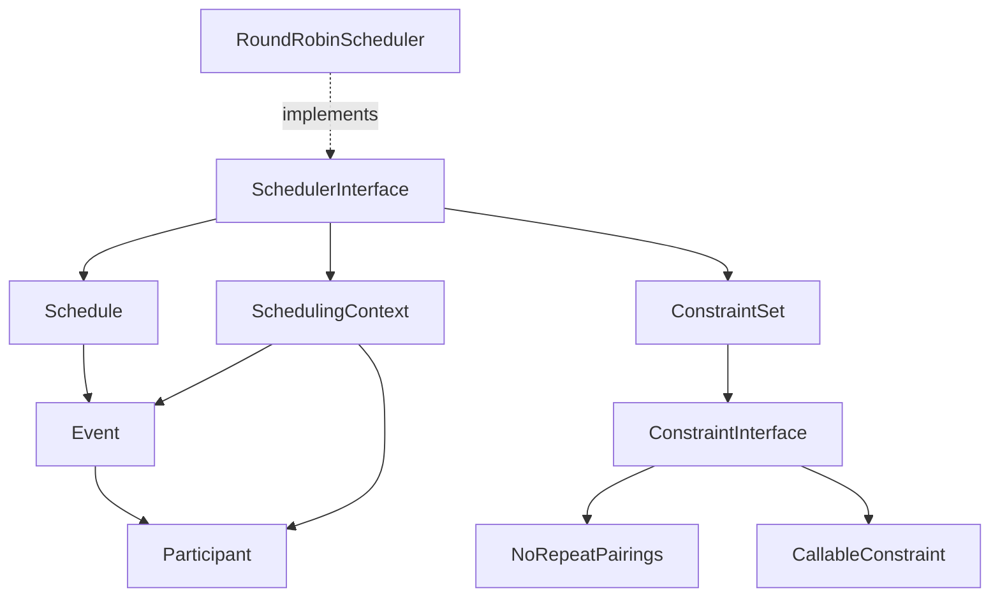

# System Patterns: Tactician

## System Architecture

The Tactician library follows a layered architecture with clear separation of concerns:

### **1. Data Layer (DTOs)**
```
src/DTO/
├── Participant.php      # Immutable participant representation
├── Event.php           # Immutable match/event representation  
├── Schedule.php        # Iterator/Countable collection of events
└── [Future] TimeSlot.php, ScheduledEvent.php
```

### **2. Scheduling Layer** 
```
src/Scheduling/
├── SchedulerInterface.php       # Contract for all schedulers
├── SchedulingContext.php        # Historical state management
├── RoundRobinScheduler.php      # Circle method implementation
└── [Future] SwissScheduler.php, PoolScheduler.php
```

### **3. Constraint Layer**
```
src/Constraints/
├── ConstraintInterface.php      # Constraint contract
├── ConstraintSet.php           # Builder pattern container
├── NoRepeatPairings.php        # Built-in constraint
└── [Future] TimeConstraints/, VenueConstraints/
```

### **4. Exception Layer**
```
src/Exceptions/
└── SchedulingException.php     # Domain-specific exceptions
```

## Key Technical Decisions

### **Immutability First**
- All DTOs are `readonly` classes preventing mutation after construction
- Methods return new instances rather than modifying existing ones (e.g., `Schedule::addEvent()`)
- Ensures thread safety and predictable behavior

### **Modern PHP 8.2+ Features**
- `readonly` classes for immutable value objects
- Constructor property promotion for cleaner code
- Strict typing throughout (`declare(strict_types=1)`)
- Union types and nullable types where appropriate

### **Interface Segregation**  
- `SchedulerInterface` defines contract for all scheduling algorithms
- `ConstraintInterface` enables pluggable validation rules
- Allows for easy testing and extensibility

### **No Static Dependencies**
- All dependencies injected through constructors
- Enables proper unit testing with mocks
- Supports different configurations per instance

## Design Patterns in Use

### **Strategy Pattern**
- `SchedulerInterface` with multiple implementations (`RoundRobinScheduler`, future Swiss/Pool)
- Allows runtime algorithm selection
- Easy to add new tournament formats

### **Builder Pattern**
- `ConstraintSet::create()` provides fluent constraint configuration
- `ConstraintSetBuilder` with method chaining
- Clean API for complex constraint combinations

### **Iterator Pattern**
- `Schedule` implements `Iterator` and `Countable`
- Memory-efficient traversal of events
- Standard PHP iteration interface

### **Template Method Pattern**
- Common scheduling logic can be extracted to abstract base class
- Algorithm-specific steps overridden in concrete implementations
- Future: `AbstractScheduler` base class

### **Command Pattern (Future)**
- Constraint violations as command objects
- Detailed reporting and resolution strategies
- Undo/redo capabilities for schedule modifications

## Component Relationships



## Critical Implementation Paths

### **Round-Robin Scheduling Flow**
1. **Input Validation**: Minimum 2 participants required
2. **Bye Handling**: Add null participant for odd counts  
3. **Circle Method**: Fix position 0, rotate others for each round
4. **Constraint Validation**: Check each proposed event against constraints
5. **Schedule Generation**: Create immutable Schedule with metadata

### **Constraint Validation Flow**
1. **Context Creation**: Build SchedulingContext with current state
2. **Constraint Iteration**: Check event against each constraint in set
3. **Predicate Evaluation**: Built-in or custom predicate validation
4. **Boolean Result**: All constraints must pass for event acceptance

### **Schedule Iteration**
1. **Iterator Interface**: Standard PHP iteration protocol
2. **Lazy Evaluation**: Events stored in array but iterated efficiently  
3. **Round Filtering**: Filter events by specific round numbers
4. **Metadata Access**: Schedule-level metadata for algorithm info

## File Structure

```
tactician/
├── .clinerules
├── .gitignore
├── composer.json
├── composer.lock
├── LICENSE
├── rector.php
├── memory-bank/
│   ├── projectbrief.md
│   ├── productContext.md
│   ├── activeContext.md
│   ├── systemPatterns.md
│   ├── techContext.md
│   └── progress.md
├── src/
│   ├── DTO/
│   │   ├── Participant.php
│   │   ├── Event.php
│   │   └── Schedule.php
│   ├── Scheduling/
│   │   ├── SchedulerInterface.php
│   │   ├── SchedulingContext.php
│   │   └── RoundRobinScheduler.php
│   ├── Constraints/
│   │   ├── ConstraintInterface.php
│   │   ├── ConstraintSet.php
│   │   └── NoRepeatPairings.php
│   └── Exceptions/
│       └── SchedulingException.php
└── tests/
    ├── Unit/
    │   ├── ParticipantTest.php
    │   ├── EventTest.php
    │   ├── ScheduleTest.php
    │   ├── ConstraintSetTest.php
    │   └── RoundRobinSchedulerTest.php
    └── Feature/
        └── RoundRobinIntegrationTest.php
```

## Future Architecture Extensions

### **Timeline System**
```
src/Timeline/
├── TimeAssignerInterface.php
├── PatternTimeline.php
├── TimeSlot.php
└── ScheduledEvent.php
```

### **Advanced Constraints**
```
src/Constraints/
├── TimeConstraints/
├── VenueConstraints/
├── ParticipantConstraints/
└── ConstraintViolation.php
```

### **Optimization Layer**
```
src/Optimization/
├── ScheduleOptimizer.php
├── ConflictResolver.php
└── QualityMetrics.php
```

---
*Last Updated: 2025-10-09*
