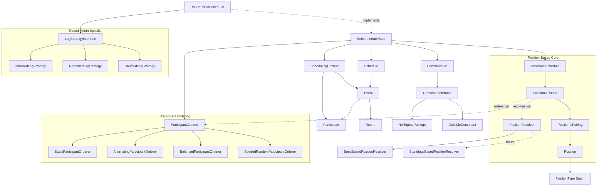

# System Patterns: Tactician

## System Architecture

The Tactician library follows a layered architecture with clear separation of concerns:

### **1. Data Layer (DTOs)**
```
src/DTO/
├── Participant.php      # Immutable participant representation
├── Event.php           # Immutable match/event representation
├── Round.php           # Immutable round representation with metadata
├── RoundSchedule.php   # Single round representation for round-by-round generation
├── Schedule.php        # Iterator/Countable collection of events
└── [Future] TimeSlot.php, ScheduledEvent.php
```

### **2. Position-Based Scheduling Layer** ✅ **NEW (2025-10-03)**
```
src/Positioning/
├── Position.php                  # Abstract position reference (seed/standing)
├── PositionType.php             # Enum: SEED, STANDING, STANDING_AFTER_ROUND
├── PositionalPairing.php        # Position-based pairing that resolves to participants
├── PositionalRound.php          # Round structure in positional terms
├── PositionalSchedule.php       # Tournament blueprint independent of participants
├── PositionResolver.php         # Interface for resolving positions to participants
└── SeedBasedPositionResolver.php # Resolves seed positions (for static tournaments)
```

### **3. Participant Ordering Layer** ✅ **NEW (2025-10-03)**
```
src/Ordering/
├── ParticipantOrderer.php           # Interface for ordering participants in events
├── EventOrderingContext.php         # Context with round/event/leg/scheduling info
├── StaticParticipantOrderer.php     # Maintains array order (default)
├── AlternatingParticipantOrderer.php # Alternates based on event index
├── BalancedParticipantOrderer.php   # Balances home/away by history (Swiss-ready)
└── SeededRandomParticipantOrderer.php # Deterministic randomization per event
```

### **4. Scheduling Layer**
```
src/Scheduling/
├── SchedulerInterface.php       # Unified contract for all schedulers
├── SchedulingContext.php        # Multi-leg historical state management
├── RoundRobinScheduler.php      # Circle method with position-based generation
└── [Future] SwissScheduler.php, PoolScheduler.php
```

### **5. Leg Strategy Layer** (Round-Robin Specific)
```
src/LegStrategies/
├── LegStrategyInterface.php     # Strategy contract for leg generation
├── MirroredLegStrategy.php      # Home/away role reversal strategy
├── RepeatedLegStrategy.php      # Identical leg repetition strategy
├── ShuffledLegStrategy.php      # Randomized pairing order strategy
└── [Future] AdvancedLegStrategies/
```

### **6. Constraint Layer**
```
src/Constraints/
├── ConstraintInterface.php             # Constraint contract
├── ConstraintSet.php                  # Builder pattern container
├── NoRepeatPairings.php               # Built-in no-repeat constraint
├── MinimumRestPeriodsConstraint.php   # Time-based rest period enforcement
├── SeedProtectionConstraint.php       # Tournament seeding protection
├── ConsecutiveRoleConstraint.php      # Positional/role-based constraints
├── MetadataConstraint.php             # Flexible metadata-based rules
└── [Future] TimeConstraints/, VenueConstraints/
```

### **7. Exception Layer**
```
src/Exceptions/
├── SchedulingException.php           # Abstract base for domain exceptions
├── InvalidConfigurationException.php # Configuration/input errors
├── IncompleteScheduleException.php   # Schedule generation failures
├── ImpossibleConstraintsException.php # Mathematically impossible constraints
└── UnsupportedOperationException.php # Unsupported scheduler operations
```

## Key Technical Decisions

### **Immutability First**
- All DTOs are `readonly` classes preventing mutation after construction
- Methods return new instances rather than modifying existing ones (e.g., `Schedule::addEvent()`)
- Ensures thread safety and predictable behavior

### **Modern PHP 8.2+ Features**
- `readonly` classes for immutable value objects
- Constructor property promotion for cleaner code
- Strict typing throughout (`declare(strict_types=1)`)
- Union types and nullable types where appropriate

### **Interface Segregation**  
- `SchedulerInterface` defines contract for all scheduling algorithms
- `ConstraintInterface` enables pluggable validation rules
- Allows for easy testing and extensibility

### **No Static Dependencies**
- All dependencies injected through constructors
- Enables proper unit testing with mocks
- Supports different configurations per instance

### **Position-Based Scheduling Architecture** ✅ **NEW (2025-10-03)**
- Tournament structures defined as positions (SEED, STANDING, STANDING_AFTER_ROUND)
- Structures can be generated and inspected before participant assignment
- Positions resolve to participants via PositionResolver strategy pattern
- Enables both static (round-robin) and dynamic (Swiss) tournament generation
- Universal abstraction works across all tournament formats

### **Participant Ordering System** ✅ **NEW (2025-10-03)**
- Participant order within events controlled via ParticipantOrderer strategy
- Separate concern from leg strategies (home/away ≠ participant ordering)
- Four built-in orderers: Static, Alternating, Balanced, SeededRandom
- BalancedParticipantOrderer tracks history for Swiss-ready home/away balancing
- Universal applicability across all tournament algorithms

### **Leg Strategies** (Round-Robin Specific)
- Leg strategies are round-robin specific (not universal to all algorithms)
- Integrated generation approach prevents silent event skipping
- SchedulingContext inherently multi-leg aware with full tournament context
- All-or-nothing schedule generation with enhanced diagnostics
- Composable with any participant orderer

## Design Patterns in Use

### **Strategy Pattern**
- `SchedulerInterface` with multiple implementations (`RoundRobinScheduler`, future Swiss/Pool)
- `PositionResolver` with implementations (SeedBased, future StandingsBased)
- `ParticipantOrderer` with four implementations (Static, Alternating, Balanced, SeededRandom)
- `LegStrategyInterface` with three implementations (Mirrored, Repeated, Shuffled)
- Allows runtime algorithm/strategy selection
- Easy to add new tournament formats and ordering strategies

### **Builder Pattern**
- `ConstraintSet::create()` provides fluent constraint configuration
- `ConstraintSetBuilder` with method chaining
- Clean API for complex constraint combinations

### **Iterator Pattern**
- `Schedule` implements `Iterator` and `Countable`
- Memory-efficient traversal of events
- Standard PHP iteration interface

### **Template Method Pattern**
- Common scheduling logic can be extracted to abstract base class
- Algorithm-specific steps overridden in concrete implementations
- Future: `AbstractScheduler` base class

### **Factory Pattern**
- `MetadataConstraint` with factory methods for common patterns
- `ConsecutiveRoleConstraint` with specialized factories (homeAway, position)
- Simplified constraint creation for standard use cases

### **Command Pattern (Future)**
- Constraint violations as command objects
- Detailed reporting and resolution strategies
- Undo/redo capabilities for schedule modifications

## Component Relationships



## Critical Implementation Paths

### **Position-Based Scheduling Flow** ✅ **NEW (2025-10-03)**
1. **Structure Generation**: Generate PositionalSchedule with Position references
2. **Position Resolution**: Resolve positions to participants via PositionResolver
3. **Participant Ordering**: Apply ParticipantOrderer to control event-level ordering
4. **Event Creation**: Create Event objects with properly ordered participants
5. **Context Updates**: Maintain SchedulingContext with complete tournament history
6. **Constraint Validation**: Validate events against constraints with full context
7. **All-or-Nothing Result**: Complete schedule or detailed failure diagnostics

### **Round-Robin with Position System**
1. **Input Validation**: Minimum 2 participants, valid configuration
2. **Positional Structure**: Generate position-based pairings using circle method
3. **Seed Resolution**: Use SeedBasedPositionResolver to map positions to participants
4. **Participant Ordering**: Apply configured ParticipantOrderer (default: Static)
5. **Multi-Leg Generation** (if applicable): Apply LegStrategy with full context
6. **Constraint Validation**: Real-time validation with incremental context building
7. **Schedule Assembly**: Return complete Schedule with metadata and positional structure

### **Participant Ordering Application** ✅ **NEW (2025-10-03)**
1. **Context Creation**: Build EventOrderingContext with round/event/leg/scheduling data
2. **Orderer Invocation**: Call ParticipantOrderer.order() with participants and context
3. **Order Application**: Use ordered participants for Event creation
4. **History Tracking** (Balanced): Track participant home/away counts across events
5. **Deterministic Randomization** (SeededRandom): Use CRC32 hash for consistent randomness
6. **Composition**: Works independently with any LegStrategy

### **Enhanced Constraint Validation Flow**
1. **Full Context Creation**: Build SchedulingContext with complete tournament state
2. **Cross-Leg Awareness**: Constraints see events from all legs during validation
3. **Early Failure Detection**: Impossible constraints detected as conflicts arise
4. **Detailed Diagnostics**: Constraint violations include suggestions and analysis
5. **Continuous Context Updates**: Context maintained across all legs and rounds

## File Structure

```
tactician/
├── .clinerules
├── .gitignore
├── .php-cs-fixer.dist.php
├── composer.json
├── composer.lock
├── LICENSE
├── phpstan.neon
├── phpunit.xml
├── README.md
├── rector.php
├── memory-bank/
│   ├── projectbrief.md
│   ├── productContext.md
│   ├── activeContext.md
│   ├── systemPatterns.md
│   ├── techContext.md
│   ├── progress.md
│   └── refactoringPlan.md        # NEW: Detailed technical specification
├── src/
│   ├── DTO/
│   │   ├── Participant.php      # Advanced DTO with ID/label/seed/metadata
│   │   ├── Event.php           # Multi-participant event with round tracking
│   │   ├── Round.php           # Immutable round representation with metadata
│   │   ├── RoundSchedule.php   # Single round for round-by-round generation
│   │   └── Schedule.php        # Iterator/Countable schedule collection
│   ├── Positioning/            # Position-based scheduling (NEW 2025-10-03)
│   │   ├── Position.php
│   │   ├── PositionType.php
│   │   ├── PositionalPairing.php
│   │   ├── PositionalRound.php
│   │   ├── PositionalSchedule.php
│   │   ├── PositionResolver.php
│   │   └── SeedBasedPositionResolver.php
│   ├── Ordering/              # Participant ordering (NEW 2025-10-03)
│   │   ├── ParticipantOrderer.php
│   │   ├── EventOrderingContext.php
│   │   ├── StaticParticipantOrderer.php
│   │   ├── AlternatingParticipantOrderer.php
│   │   ├── BalancedParticipantOrderer.php
│   │   └── SeededRandomParticipantOrderer.php
│   ├── Scheduling/
│   │   ├── SchedulerInterface.php     # Unified contract for all schedulers
│   │   ├── SchedulingContext.php      # Historical state management
│   │   └── RoundRobinScheduler.php    # Position-based with multi-leg support
│   ├── LegStrategies/         # Round-robin specific leg strategies
│   │   ├── LegStrategyInterface.php
│   │   ├── MirroredLegStrategy.php
│   │   ├── RepeatedLegStrategy.php
│   │   └── ShuffledLegStrategy.php
│   ├── Constraints/
│   │   ├── ConstraintInterface.php
│   │   ├── ConstraintSet.php
│   │   └── [Multiple constraint implementations]
│   ├── Validation/
│   │   └── [Validation components]
│   └── Exceptions/
│       └── [Exception hierarchy]
└── tests/
    ├── Pest.php                      # Pest configuration
    ├── TestCase.php                  # Base test case
    ├── Unit/
    │   ├── DTO/
    │   │   ├── EventTest.php
    │   │   ├── ParticipantTest.php
    │   │   ├── RoundTest.php
    │   │   └── ScheduleTest.php
    │   ├── Constraints/
    │   │   └── ConstraintSetTest.php
    │   ├── Exceptions/
    │   └── Scheduling/
    │       └── RoundRobinSchedulerTest.php
    └── Feature/
        └── RoundRobinIntegrationTest.php
```

## Future Architecture Extensions

### **Swiss Tournament System** (Phase 4 - Next)
```
src/Scheduling/
├── SwissScheduler.php                    # Swiss tournament scheduler
├── SwissPairingAlgorithm.php            # Interface for Swiss pairing
├── SeededSwissAlgorithm.php             # Pre-determined Swiss (UEFA CL style)
└── StandingsBasedSwissAlgorithm.php     # Dynamic Swiss (traditional)

src/Positioning/
├── StandingsBasedPositionResolver.php   # Resolves STANDING positions
├── ParticipantStanding.php              # Participant with standing data
└── StandingsContext.php                 # Current standings for resolver
```

### **Timeline System** (Phase 5)
```
src/Timeline/
├── TimeAssignerInterface.php
├── PatternTimeline.php
├── TimeSlot.php
└── ScheduledEvent.php
```

### **Advanced Constraints** (Future)
```
src/Constraints/
├── TimeConstraints/
├── VenueConstraints/
├── ParticipantConstraints/
└── ConstraintViolation.php
```

### **Optimization Layer** (Future)
```
src/Optimization/
├── ScheduleOptimizer.php
├── ConflictResolver.php
└── QualityMetrics.php
```

---
*Last Updated: 2025-10-03 (Phase 3 Complete - Participant Ordering)*
